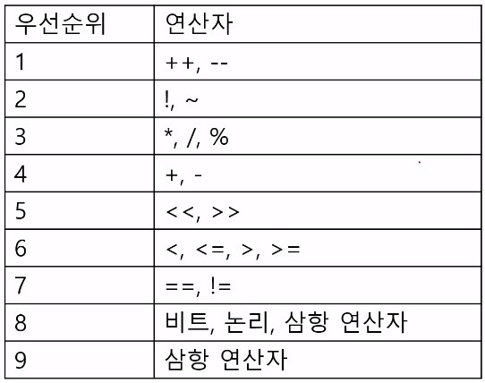

# 카카오 면접 준비

카카오 기술면접에 대비하여 질문과 답 정리


[TOC]


## 1. SSAFY

> 싸피에서 공부한 내용 및 프로젝트 관련 질문


### 1.1. 파이썬

#### 데이터

- 변수: 변수는 박스로, 값을 저장함(할당)
  - 파이썬은 자바나 C와는 달리 튜플을 이용한 동시할당이 가능
  - 식별자로 예약어는 불가(False, None, return 등)
  - **부동소수점이란? **[wiki](https://ko.wikipedia.org/wiki/%EB%B6%80%EB%8F%99%EC%86%8C%EC%88%98%EC%A0%90)
    - 정의: 실수를 근사하여 유효숫자를 나타내는 가수롸 소수점의 위치를 풀이하는 지수로 나누어 표기하는 것
    - 고정 소수점 방식보다 넓은 범위가 표현 가능하나 느림
    - 부동소수점 빼기 연산 시 정확히 0이 안 되는 현상 발생: **왜?**
      - 원래 수를 지수부로 나눈 값이 가수부로 표기되는데 이게 안 나누어 떨어지기 때문[참고](https://www.secmem.org/blog/2020/05/15/float/)
- String
  - Concatenation: 문자열끼리 더하기
  - Interpolation: 중간에 어떤 파트를 다른 데이터로부터 가져오기
    - % operator: `'Hello %s' % 'Bob'`
    - str.format(): `'Hello {}'.format('Bob')`
    - f-strings
- Type Conversion
  - Implicit
    - None은 안 되지만 False는 0으로 변환됨
  - Explicit
    - string -> intger : 형식에 맞는 숫자만 가능
- Short-circuit evaluation
  - `print(5 and 0)` : 5
  - `print(5 or 0)` : 0
- **in 은 느리다. 왜??**
- 표현식과 문장
  - 표현식: 하나의 값으로 환원될 수 있는 문장
  - 문장: 실행 가능한 코드 단위
- 시퀀스형 컨테이너
  - 시퀀스란? 데이터가 순서대로 나열된 것: **반복 가능**
  - immutable: 튜플, 스트링, 레인지
  - mutable: 리스트
  - **수정 가능과 불가능한 이유는?**
    - C에서는 다음과 같이 데이터를 전달함
    - primitive type: call-by-value 변수의 **값을 복사**하여 전달. 함수가 호출될 때 생기는 스택 메모리 안에서 local value로 사용되기 때문에 변경되어도 외부 변수의 값은 그대로
    - reference type: call-by-reference 변수의 **레퍼런스**를 전달
    - 파이썬에서는 call-by-asignment가 사용되는데, 파이썬은 모든 것이 객체이고 immutable의 경우 객체가 arguments로 전달되면 처음에는 call-by-reference로 받으나 값이 바뀌면 call-by-value로 동작
- non-sequence container
  - set, dictionary: **mutable**
  - 딕셔너리의 키는 immutable만 가능

#### 제어문, 반복문

- 삼항 연산자 Ternary Operator:

  - `true_value if <조건식> else false_value`

- `for <임시변수> in <iterable>`

  - enumerate: 인덱스와 값을 함께 활용

  -  ```python
    for id, value in enumerate(1, 2, 3):
        print(id, ":", value)	# 0:1, 1:2, 2:3
    ```

  - for-else: 반복문을 끝까지 시행한 이후에 실행됨

    - 단, break으로 종료되지 않은 경우만

#### 함수

> 특정한 기능을 하는 코드의 묶음: 가독성, 재사용성, 유지보수

- parameter & argument
  - parameter는 **함수를 정의할 때** 매개변수의 역할을 지정함
  - argument는 **함수가 호출될 때** 실제 전달되는 입력값
- Argument
  - 함수는 기본적으로 위치로 인자를 판단: positional arguments
  - Default Argument Value을 가지는 인자 다음에 기본 값이 없는 인자를 사용할 수는 없음
    - 키워드 인자와 가변 인자는 사용 가능
  - `키워드 인자`를 활용한 다음에 `위치 인자`를 활용할 수는 없습니다.
    - 키워드 인자를 쓸거면 뒤에만 쓰거나 다 써야 함!
  - `*args`(가변 인자 리스트)
    - tuple로 처리되며 매개변수에 * 로 표시
    - 매개변수 목록의 마지막에 옴
  - `**kwargs`(가변 키워드 인자): 정해지지 않은 수의 키워드로 이루어짐
    - 딕셔너리로 처리됨
  - 
- 스코프(유효 범위)
  - **왜 필요한가?** 
    - 긴 코드 내부에서 변수 간 충돌을 방지하기 위해
    -  global은 가능하면 쓰지 말아야 함! `single-responsibility`
  - LEGB rule: Local, Enclosed, Global, Built-in
  - 수명주기
    - 빌트인: 파이썬 실행 이후
    - 전역: 모듈 호출 이후 인터프리터 종료 시까지
    - 지역, 함수: 함수 종료될 때까지. 예외 발생 시 삭제
- 에러
  - 문법 에러
    - EOL: 따옴표 에러
    - EOF: 괄호 닫기 에러
  - 예외: 문법적으로는 옳지만 실행에서 문제가 생긴 경우
    - NameError: 정의되지 않은 변수 호출
    - ZeroDivisionError
    - TypeError
    - ValueError: 타입은 올바르나 값이 적절하지 않은 경우 `int('3.5')`
- try & except
  - 먼저 try를 실행
  - 예외가 발생되지 않으면 종료, 발생되면 except를 실행
    - except 예외클래스 as err
      - 에러 메시지를 표현, err라는 객체를 생성함
    - 튜플을 이용하여 복수의 예외를 지정할 수 있음
    - 예외는 계층화되어 있음: 복수처리할 때는 하위부터
      - 예) KeyError는 LookupError에 포함
  - 에러가 발생하지 않는 경우 실행 시킬 문장은 else를 활용
  - 에러와 관계 없이 실행되야만 하는 코드는 finally 활용
  - **raise와 assert의 차이는?**
    - raise는 항상, assert는 검증식이 거짓일 때 예외가 발생
    - raise는 지정한 예외가, assert는 AssertionError가 발생
    - raise는 오류를 이미 발견한 상황에서 발생시키는 것이고 assert는 간단한 논리 오류를 검사하기 위해서 사용

#### 데이터 구조

- 스트링: 변경 불가, 순서 있음, 순회 가능
  - `.join()`: **느린가??**
    - concatenation은 새로운 문자열을 생성하기 때문에 메모리를 많이 먹고 느림: join이 권장됨
- 리스트: 변경 가능, 순서 있음, 순회 가능
  - `.sort()`: 원본 list를 변형시키고, 리턴값 없음
  - `.reverse()`반대로 뒤집음
  - 리스트의 복사
    - Shallow Copy: 슬라이싱, list()
    - Deep Copy: import copy, copy.deepcopy (오래 걸림)
- 세트: 변경 가능, 순서 없음, 순회 가능, **중복 없음**
  - remove는 에러 뜨는데 discard는 에러 안 뜸
- 딕셔너리: 변경 가능, 순서 없음, 순회 가능
  - `.update()` **이거 필요한 이유?**
  - 딕셔너리 순회하는 방법
    - `for key in dict:`
    - `for key in dict.keys():`
    - `for val in dict.values():`
    - `for key, val in dict.items():`
  - dictionary comprehension
    - `{키:값 for 요소 in iterable if 조건식}`

#### OOP

- 모듈: 특정 기능을 .py 파일 단위로 작성

  - 패키지: 모듈의 집합으로 모듈을 구조화하기 위해 사용 

- 객체: **객체란?**

  - 타입: 공통된 속성과 조작법을 가진 객체들
    - 인스턴스는 특정 타입의 실제 데이터 예시
    - 모든 객체는 특정 타입의 인스턴스이다
    - 클래스는 사용자 정의 데이터형(user-defined data type)
  - 속성: 객체의 상태/데이터
    - 특정 클래스로부터 나온 인스턴스는 모두 해당 속성을 가짐
  - 조작법(method)
    - 특정 개체에 적용 가능한 행위: `객체.메서드()`

- OOP: 프로그램을 객체의 모임으로 파악하는 패러다임

  - 코드의 직관성, 활용의 용이성, 변경의 유연성
  - **절차적 프로그래밍과 비교하면 어떤가?**
    - 명령어의 모음: 입력을 순서대로 처리한 다음 결과를 내는 것
    - 모든 순서를 파악하고 있어야 하기 때문에 유지보수 난해
  - OOP의 특징
    - encapsulation: 변수와 함수를 묶는 것 - 클래스로 구현
    - inheritance:      부모 클래스를 재사용할 수 있음
    - polymorphism

- 메서드

  - 생성자`__init__(self)`: 생성될 때 자동으로 호출 - 인스턴스 속성 정의
  - 소멸자 `__del__(self)`: 소멸될 때 자동으로 호출
    - 인스턴스가 다른걸 참조하면 **Garbage Collector**가 자동으로 kill
    - GC: 메모리 누수를 막기 위해 할당된 메모리 영역 중 쓰이지 않는 영역을 자동으로 해제해주는 것 - 자세한 건 OS로 ㄱ
  - `__str__()`: 특정 객체를 출력할 때 보여줄 메세지
  - 메서드는 호출 시 첫번째 인자로 인스턴스 자신(self)이 전달됨
  - 클래스 메서드
    - @classmethod 데코레이터를 사용해 정의
    - 호출 시 첫 번째 인자로 cls가 전달됨
  - 스태틱 메서드
    - @staticmethod 데코레이터를 사용해 정의
    - 호출 시 인자를 전달하지 않음
  - 인스턴스에서도 클래식, 스태틱 메서드 접근 가능하나 권장하지 않음

- 속성

  - 인스턴스와 클래스 모두에서 같은 속성 이름이 등장하면, **속성 조회는 `인스턴스를 우선`**한다
  - 인스턴스에서 변수 조회가 안되면 클래스, 안되면 상위 클래스 조회 

- 상속

  - class 클래스 이름(상위 클래스 이름) 으로 정의

  - `super()`를 이용해 부모 클래스의 내용 사용

    - ```python
      class Person:
          def __init__(self, name, age, number, email):
              self.name = name
              self.age = age
              self.number = number
              self.email = email 
              
          def greeting(self):
              print(f'안녕, {self.name}')
              
              
      class Student(Person):
          def __init__(self, name, age, number, email, student_id):
              # Person()
              super().__init__(name, age, number, email)
              self.student_id = student_id
      ```

    - 자식 클래스 인자가 부모와 같으면 안 써도 됨

  - 자식 클래스에서 부모 클래스의 메서드 오버라이딩(재정의) 가능

  - **오버로딩** : 같은 이름의 메서드를 여러 개 가지면서 매개변수의 유형과 갯수를 다르게 하는 것. polymorphism을 위한 것이다


### 1.2. HTML/CSS

> HTML과 CSS를 합쳐 퍼블리싱 작업이라고 표현하고 이 작업을 하는 사람을 퍼블리셔라 함

#### HTML

> 웹 컨텐츠의 의미와 구조를 정의
>
> HyperText Markup Language

- 시맨틱 태그
  - 콘텐츠의 의미를 명확히 설명하는 태그
  - 마크업 언어는 텍스트에 역할을 부여하는 것
  - 시맨틱 웹: 웹페이지를 의미와 관련성을 가지는 거대한 DB로 구축하고자 하는 발상
- Document Object Model
  - 웹 페이지에 대한 인터페이스: HTML 요소들의 구조화된 객체 지향 표현
    - 텍스트로 구성된 HTML을 객체 모델로 변환, 브라우저에 내장되어있음
    - 노드 트리로 표현됨: 태그는 줄기, 컨텐츠는 잎
    - JS에 의해 수정될 수 있는 동적 모델
    - **가상 요소**를 포함하지 않음
      - CSS에 사용되는.... 뭐지?
    - **보이지 않는 요소**를 포함
      - `display: none` 스타일 속성을 갖는 요소
  - 브라우저는 문서를 파싱하여 View Port에 뭘 렌더링할지 결정(Render Tree)하고, 해당 렌더링을 수행하는데 렌더 트리를 생성할 때 DOM과 CSSOM이 필요
- 요소
  - 태그 사이의 내용
  - 중첩(nested)될 수 있음
    - 교차해서는 안 됨
    - 인라인 태그(strong, em, i)는 블록 태그를 포함할 수 없음
- 속성
  - 태그의 부가적인 정보: 파일의 경로, 크기 등
  - 요소의 시작 태그에 위치하며 이름과 값의 쌍을 이룸
- DTD(DOCTYPE)
  - 문서타입: HTML5, HTML4, XHTML중 무엇인지 나타내 줌
  - 싸피에서는 html5만 다루었음

#### CSS

> Cascadding Style Sheets
>
> HTML이 사용자에게 어떻게 표시되는지 지정

- 속성과 값
  - 사람이 읽을 수 있는 식별자인 속성(너비, 색 등)에 값을 부여
- CSS 정의 방법
  - 인라인 스타일, 내부 참조, 외부 참조
- CSS Selector
  - 우선순위: `!important`, inline style, id, class, 요소(태그), 순서(cascade)
  - id 선택자
    - `#` 문자로 시작, 아이디는 문서당 하나만 사용 가능
    - 링크 이동이나 for를 사용하는 경우에만 사용
  - class 선택자
    - 마침표 문자로 시작, 해당 클래스가 적용된 문서의 모든 항목 선택
  - 복합 선택자
    - 자손: `selector a selector b`
    - 자식: `selector a > selector b`
- Box Model
  - 컨텐츠를 담을 박스를 지정하고 스타일, 위치, 정렬을 지정함
  - content: 글, 이미지, 비디오 등 요소의 내용
  - padding: 내부 여백, 배경색 및 이미지 지정 가능
  - border
  - margin: 바깥쪽 여백, 배경색 지정 불가. 마진은 큰 쪽으로 결합되어 상쇄될 수 있음
- Display
  - block: 기본 요소
  - inline
    - 줄바꿈이 일어나지 않는 행의 일부요소
    - width, height, mt, mb 지정 불가
    - 상하 여백은 line-height로 지정
  - inline-block: block속성 사용 가능하고 텍스트 흐름대로 나열함
  - none
    - 화면에서 요소가 사라지며 요소가 차지하는 공간도 사라짐
    - `visibility: hidden`은 공간은 사라지지 않음
- Position
  - static: 기본
  - relative: static을 기준으로 위치 이동
  - absolute
    - 부모/조상 기준으로 이동, 부모가 없으면 body에 붙음
    - 과거 위치에 있던 공간은 사라짐: 다른 것에 상관 없이 독자적인 곳에 놓이게 됨
    - 팝업 정보 상자 등 다른 요소와 위치에 간섭하지 않는 UI 기능 만들기
  - fixed: viewport(현재 보이는 영역) 기준으로 이동 - 항상 같은 곳에 위치
- float
  - 옛날에 레이아웃을 만들기 위해 사용되던 기술
- flexbox
  - 아이템 간 공간 배분과 정렬
  - 컨테이너를 선언: `display="flex"`
  - flex-direction, flex-wrap, flex-flow, jistify-content, align-items, align-self, order, flex-grow
- bootstrap

#### 반응형 웹

> 브라우저의 가로 넓이에 **반응**하여 구성 요소가 변하는 기술
>
> 모바일로 웹페이지를 보는 일이 늘어나면서 생김

넓이에 따라 CSS를 추가로 코딩해야 하기 때문에 비용이 증가하는 문제가 있음

.container > .row > col-*


### 1.3. Django

> 장고의 특징: MTV, ORM, admin, URL design, 표현과 로직의 분리(템플릿 상속), 소스 변경사항 자동 반영


#### 프레임워크란?

> 프랜차이즈 같은 것: 앱개발을 지원하기 위한 개발 kit라고 보면 됨
>
> 한 프로젝트에 프레임워크는 하나만 쓸 수 있음

- 애플
  - 코코아: UIKit, AppKit 등
- 구글
  - AndroidFramework
- 웹
  - AngularJS
  - Vue.js
  - React
  - Django


#### MTV


#### CRUD

- csrf token
  - csfr란 이용권한을 도용하여 특정 웹사이트를 공격하는 행위 [참고](https://itstory.tk/entry/CSRF-%EA%B3%B5%EA%B2%A9%EC%9D%B4%EB%9E%80-%EA%B7%B8%EB%A6%AC%EA%B3%A0-CSRF-%EB%B0%A9%EC%96%B4-%EB%B0%A9%EB%B2%95)
  - 사용자의 세션에 난수 값을 저장하고 요청을 받을 때마다 세션에 저장된 토큰값과 요청 파라미터에 전달되는 토큰 값이 일치하는지 검증
- 


#### Form/STATIC,Media

##### Form

> Django의 유효성 검사 도구
>
> 입력된 데이터의 유효성을 검증하고, 필요시에 입력된 데이터를 검증 결과와 함께 다시 표시하며, 유효한 데이터에 대해 요구되는 동작을 수행하는 걸 자동으로 해줌

- Form과 ModelForm의 차이
  - Model에서 이미 정의한 필드를 가져와서(상속해서) 만드는 것이 Modelform
    - Model Fields: DB Field 들을 파이썬 클래스화
    - Form Fields: HTML Form Field 들을 클래스화
  - **왜 ModelForm은 requst.POST를 인자로 받는지?**
    - ㅇ

##### Static

> 웹 사이트의 구성 요소 중에서 해당 내용이 고정되어 응답을 할 때 별도의 처리 없이 파일 내용을 그대로 보여주면 되는 파일

- 여기는 읽으면서 한 번 따라해봐야겠는데?

##### Media

> 사용자가 웹에서 올리는 파일 파일 자체는 고정 이지만, 언제/어떤 파일이 정적 파일로 제공 되는지는 예측할 수 없는 파일


#### Authentication

- authentication vs authorization
  - 신원 확인 vs 권한 부여
- 로그인
  - 로그인은 세션을 Create하는 것
  - 신원을 확인(AuthenticationForm)하고 유효성검사를 거친 후 Create(auth_login함수가 수행)


#### REST API


### 1.4. DB

#### ORM

> OOP 프로그래밍 언어를 사용하여 *호환되지 않는 시스템 간에*  데이터를 변환하는 기술
>
> 프로그래밍 언어에서 사용할 수 있는 가상 객체 DB를 만들어 사용

#### 1:N


#### M:N


### 1.5. JavaScript

#### 기본개념

- 역사
  - 처음엔 넷스케이프에서 동적 웹페이지 만들려고 개발
    - Scheme Script를 베이스로 자바 문법과 비슷하게
  - ECMA International에서 문법적 사항을 정리한 문서 ECMA Script 발간(1997)
  - 그러나 MS에서 이를 생까고, 파이어폭스 출시(2004)되면서 크로스 브라우징 이슈 심화
    - JQuery, dojo, mootools 등의 라이브러리를 이용해 다양한 브라우저에서 동작하는 동적 웹사이트를 만들게 됨
  - **AJAX** 도입
    - 서버와 통신하기 위해 **XHR(XMLHttpRequest)**객체를 사용하는 것(옛날 방식: 요즘엔 서브파티 라이브러리 많이 쓴다)
    - 비동기적으로 수행되며, 페이지의 일부를 업데이트 하고, HTML, JSON, Txt를 교환
  - 크롬 도입(Just In Time compliation): JS 실행 속도가 굉장히 빠름
  - 표준화 논의: ES5출시(2009), ES6출시(2015)
    - 현재는 모든 브라우저가 ES를 잘 따르고 있음
- 구성
  - JS 엔진
    - 메모리 힙: 메모리 할당을 실시
    - 콜 스택: 스택 프레임 코드를 실행, 함수 호출을 일시적으로 저장-관리
  - 이벤트 루프
    - 현재 실행중인 태스크가 없는지(콜스택이 비었는지), 태스크 큐가 비었는지 반복적으로(tick) 확인
    - 콜스택이 비었으면 태스크큐의 첫번째 태스크를 가져옴
  - web api
    - 스택에서 비동기 함수를(ajax, setTimeout) 만나면 여기로 이동
    - 여기서 실행된 함수의 리턴값은 태스크 큐로 이동함
  - task queue(callback queue)
    - FIFO
    - 스택이 비어있을 경우 태스크 큐에서 콜스택으로 전달
    - **마이크로 태스크 큐**
      - Promise의 `then()` 메서드는 여기에 추가됨
      - 이벤트 루프는 태스크 큐보다 여기 있는 함수를 우선적으로 처리
    - Animation Frame이라는 것도 있는데 일단 생략
- 실행 컨텍스트
  - 실행 가능한 코드를 형상화하고 구분
- 특징
  - 비동기성: 싱글 스레드이기 때문
    - 특정 시점에 어떤 일(콜백 함수)을 이어나감
  - Callback 함수: 1급 객체임
    - **1급 객체**: 리턴값으로 사용가능, 함수 인자로 사용가능, 변수 할당가능
    - 연쇄적인 콜백함수의 사용은 콜백 지옥으로 이어짐
  - Promise
    - 콜백 지옥을 해결
    - 성공/실패의 상황을 가정


#### 기본 문법

- `console`
  - 웹 API로, 언어 자체에 포함된 것이 아니라 브라우저가 이해할 수 있는 함수:  브라우저의 Dev Tool에서 직접 사용하기 가능
  - Node.js같은 애들도 포함하고 있음
- `async` vs `defer`
  - 공통점: JS코드를 만나면 parsing과 병렬적으로 JS코드를 다운로드(fetching)
  - async
    - 해당 JS코드 다운로드가 끝나면 실행(executing)
    - 순서에 의존적인 JS코드라면 문제가 생길 수 있음
    - 파싱이 끝나기 전에 실행되기 때문에 필요한 DOM요소가 아직 없다면 문제가 생길 수 있음
    - 파싱을 중단하기 때문에 페이지를 보기까지 시간이 걸림
  - defer
    - 파싱이 완료되면 JS코드를 작성 순서에 따라 실행
    - 관련 컴포넌트들이 준비되지 않은 상태에서 화면을 보게 됨: **사용불가 처리**를 해줘야 함
- `'use strict'`를 맨 위에 침으로써(ES5에 도입됨) 호이스팅 방지


#### 데이터 타입

- let: 유일한 **변수**(mutable)

  - ES6에 추가됨
  - var는 이제 쓰면 안 됨: 블럭을 무시하기 때문
    - Hoisting: 선언 위치에 상관 없이 제일 위로 선언을 끌어올림
    - 간단한 프로그램에서는 유연하고 좋지만 규모가 커지면 에러의 원인이 됨
  - Increment
    - postIncrement: `value++`
    - preIncrement: `++value`

- **Block Scope**

  - 블럭 {} 밖에서 접근할 수 없게 함
  - 블럭 밖의 변수는 Global Scope
    - 어플이 종료될 때까지 메모리를 차지하므로 사용 최소화 권장
    - 클래스, 함수, 반복문 등 필요한 부분에서만 쓰자

- const(read only)

  - 포인터가 잠겨있기 때문에 값을 재할당할 수 없음(immutable)
  - 보안성
  - thread safety
    - 여러 쓰레드가 동시에 값을 변경하려고 하여 충돌할 일이 없음
  - reduce human mistakes

- **Dynamic typing**

  - 어떤 타입인지 선언하지 않고 런타임 때 타입을 변경할 수 있음

  - 빠르게 프로토타이핑할 때 유용하지만 규모가 커지면 머리 아플 수 있음!

  - ```javascript
    let text = 'hello';
    console.log(`value: ${text}, type: ${typeof text}`)
    text = 1;
    console.log(`value: ${text}, type: ${typeof text}`)
    text = '7' + 5;
    console.log(`value: ${text}, type: ${typeof text}`)
    text = '8' / '2';
    console.log(`value: ${text}, type: ${typeof text}`)
    // value: hello, type: string
    // value: 1, type: number
    // value: 75, type: string
    // value: 4, type: number
    ```

  - 중간에 타입이 바껴서 (스트링 -> 넘버) 인덱싱을 못하는 바람에 런타임 에러가 생기는 등의 문제가 있을 수 있음: TypeScript로 해결

- Operation

  - Short circuit evaluation
    - 파이썬과 마찬가지로 or(||)연산은 true가 나오면 끝
    - 따라서 함수같이 무거운 것은 최대한 뒤로


#### 함수

- Early return, Early exit
  - 조건이 만족될 때 특정 로직이 도는 함수가 있다면
  - 조건이 안 맞는 경우 먼저 리턴, 그 후에 조건이 맞는 경우에 대한 로직을 작성하는 것이 효율적
- function expression: 1급 객체로 기능하게 해 줌
  - function declaration은 호이스팅 가능하나 이것은 불가
    - 변수에 할당된 이후에만 실행
  - anonymous function: 이름 없이 기능만 작성해서 변수에 할당
  - named function: 디버깅하기 편하려고 씀
- Callback
  - 조건에 맞으면 다른 함수(callback func)를 호출
- Arrow function
  - 간단하게 쓰려고 사용
  - `const simplePrint = () => console.log('simplePrint!');`
  - 좀 길어지면 블럭을 써야하지만 블럭 사용시 return 명시해야
- IIFE(Immediately Invoked Function Expression)
  - 함수를 선언하는 즉시 실행하는 것: 함수를 괄호로() 둘러싸면 됨


#### 조건, 반복

- If

  - ```javascript
    const name = 'df';
    if (name === 'ellie') {
        console.log('Welcome, Ellie!')
    } else if (name === 'coder') {
        console.log('You are amazing coder')
    } else {
        cosole.log('unknown')
    }
    ```

  - Ternary operator: 간단할 때만 쓰자

  - ```javascript
    console.log(name === 'ellie' ? 'yes' : 'no')
    ```

- Switch

  - else if를 여러 개 반복하게 되면 스위치 쓰는 것이 좋음

- loop

  - ```javascript
    let i = 3;
    while (i > 0) {
        console.log(`while: ${i}`)
        i--;
    }
    ```

  - do-while: 먼저 do 블럭을 실행해 조건이 맞는지 검사

  - for-loop

  - ```javascript
    for (i = 3; i > 0; i--) {
        console.log(`for: ${i}`);
    }
    ```

  - Nesting(중복 포문) 작성 가능


#### 클래스

> ES6에 도입됨, 이전에는 바로 객체를 만들어서 사용: function을 이용

- 선언

  - `constructor(parameters) {}`: 클래스 필드 정의
    - consructor 없이 publicField, #privateField를 정의할 수 있음
    - 파이썬과 마찬가지로 static, static method 정의 가능
  - 그 밑에 메소드 선언
  - 객체를 만들 때는 `new Class()`

- Getter, Setter

  - 사용자 실수로 class property를 잘못 설정했을 때 수정하게 해줌

  - ```javascript
    class User {
        constructor(name, age) {
            this.name = name;
            this.age = age;
            // getter 정의하는 순간 this.age는 메모리에 올라간 데이터가 아니라 getter를 호출
            // setter를 정의하는 순간 값을 할당할 때 setter를 호출
    
        }
        get age() {
     	   return this._age;
    	}
    	set age(value) {
            if (value < 0) {
                throw Error('age cannot be negative');
            }
        	this._age = value;
            // 할당할 때 setter가 호출되는데 age변수 이름이 같으면 계속 돌기 때문에 '_'를 앞에 붙이는 게 convention
    	}
    }
    ```

- 상속, 다형성

  - extends를 통해 상속함
    -  `class Rectangle extends Shape {}`
    - Overriding 가능: `super.method()`하면 부모 메소드도 사용

- **Object**

  - 클래스를 이용해서 만들거나(new), 중괄호를 이용해서 생성(object literal)
  - object는 key, value의 집합체
    - in operator: 키가 있는지 체크하는 bool 함수
    - for .. in vs for .. of
      - `for (key in ellie) {}`: object 내의 키를 순회
      - `for (value of iterable) {}`: 배열 내의 원소를 순회
  - object의 copy
    - object는 call by reference이기 때문에  
    - for문을 돌면서 일일이 복사를 해주거나(old way)
    - `Object.assign()`을 활용: assign<Target, source1, source2>
      - `const user2 = Object.assign({}, user);`
      - source가 여러 개이고 같은 필드가 있으면 뒤에 있는 것이 덮어씌우게 됨


#### 배열

- 배열 순회
  - `fruits.forEach((fruit, index) => console.log(fruit))`
- 배열 조작
  - 뒤에 추가: `.push()`  뒤에서 빼기: `.pop()`
  - 앞에 추가: `.unshift()`  앞에서 빼기: `.shift()`
  - 앞에서 빼거나 추가하는 것은 굉장히 느리기 때문에 안 쓰는 것이 좋음
- 검색
  - 인덱스 반환: `.indexOf()` 여러개 있으면 제일 먼저 나오는 인덱스 반환, 반대는 `.lastIndexOf()`
  - 존재여부 찾기: `.includes()`  indexOf()도 쓸 수 있는데 포함 안 되어 있으면 -1이 반환됨


#### JSON

- XML

  - HTML과 같은 마크업 언어로, 태그를 이용하여 데이터를 표현함
  - 아웃룩이 XML을 이용하여 데이터를 주고받았기 때문에 AJAX(Asynchronous Javascript And XML), XHR(XML Http Request)에 XML 이름이 들어가 있음

- JSON: JavaScript Object Notation

  - JS의 object가 키-밸류로 이루어져 있듯 JSON도 그러함
  - 프로그래밍 언어나 플랫폼에 상관 없이 사용 가능

- Serialization

  - (언어별로) object를 JSON으로 변환하는 것

  - Object to JSON

    - `JSON.stringify(object)`: object 뒤에 callback함수를 넣어서 변환을 통제할 수 있음
    - 오브젝트 함수는 JSON으로 변환되지 않음: JSON이 될 때 전부 String으로 바꾸기 때문

  - JSON to Object(deserialization)

    - `JSON.parse(json)`

    - json뒤에 reviver이라는 콜백함수를 이용하여 스트링으로 변환된 원본의 객체를 살릴 수 있음

    - ```javascript
      const obj = JSON.parse(json, (key, value) => {
          console.log(`key: ${key}, value: ${value}`);
          return key === 'birthDate' ? new Date(value) : value;
      })
      ```


#### Event

> HTML 문서 내에서 일어나는 일
>
> `click`, `submit`, `keydown`, `mouseover`, `submit`, `change` ...

- addEventListener

  - `EventTarget.addEventListener(type, listener)`

- event.preventDefault()

  - 각 태그의 기본 이벤트가 동작하지 않도록 막음


#### 비동기 처리

> 자바스크립트 자체는 동기적: 호이스팅이 된 이후로는 하나씩 순서대로 실행
>
> 비동기 함수를 만나면 webAPI, 태스크큐 등을 거쳐 비동기적 실행

- **Callback**
  - synchronous callback
  - asynchronous callback
  - callback hell
    - 코드 가독성이 심각함
- **Promise**
  - 비동기를 간편하게 처리할 수 있도록 도와주는 Object
    - 정해진 *장시간의 기능* 을 수행하고 성공한다면 결과를, 실패한다면 에러를 전달
    - 시간이 오래걸리는 코드를 동기적으로 처리하면 다음 라인의 코드가 실행되지 않기 때문에 Promise를 만들어 비동기적으로 처리하는 것이 좋다
      - ex) network, read files
    - Promise 객체를 만들면 executor가 자동적으로 실행됨
    
  - State
    - pending: operation이 실행중일 때(resolve, reject 둘 다 호출하지 않으면 이렇게 됨)
    - fulfilled: operation을 성공적으로 마쳤을 때(resolve)
    - rejected: 파일을 찾을 수 없거나 네트워크에 문제가 생김
    
  - Producer vs Consumer
    - Producer: 원하는 기능을 수행하여 해당 데이터를 만들어 냄
      - 특정 기능이 성공하면 resolve를 통해 데이터를 전달
      - reject는 Error Object를 통해 값을 전달
    - Consumer: 원하는 데이터를 소비함
      - then: promise가 정상적으로 수행되어 resolve를 통해 전달한 값이 value라는 parameter로 들어옴
      - catch: 에러가 발생했을 때 처리하는 방식을 정의하는 callback함수
      - finally: 성공/실패 관계없이 마지막에 호출됨
    - Promise Chaining
      - then을 호출하면 promise가 리턴되고, 여기에 다시 catch를 등록함
      - 이게 콜백지옥을 깔끔하게 만들어주는 핵심
        - 프로미스 객체를 받아오기 때문에 변수명 줄줄이 쓸 필요 없음 [참고](https://youtu.be/JB_yU6Oe2eE?t=1123)
        - 심지어 변수가 1개면 생략도 가능함ㄷㄷㄷ
    
  - **Async**
  
    - promise를 동기적으로 실행하는 것처럼 보이게 해 줌
    - promise위에 API를 제공해줌(`syntatic sugar`)
    - 함수 앞에 async를 써주면 자동으로 (함수 안의 내용물을 실행하는) Promise가 됨
  
  - **Await**
  
    - async가 붙은 함수 안에서만 쓸 수 있음
    - 비동기적인 수행 앞에 붙여주면 해당 수행을 마친 이후에 다음으로 넘어가게 됨
  
  - async & await의 사용
  
    - Promise도 중첩하게되면 결국 콜백지옥과 다를 것이 없음
  
    - ```javascript
      function pickFruits() {
          return getApple().then(apple => {
              return getBanana().then(banana => `${apple} + ${banana}`);
          });
      }
      ```
  
    - ```javascript
      async function pickFruits() {
          const apple = await getApple();
          const banana = await getBanana();
          return `${apple} + ${banana}`;
      }
      ```
  
    - 다만 독립적인 두 과정을 직렬로 수행하면 낭비: 병렬처리 가능
  
    - ```javascript
      async function pickFruits() {
          const applePromise = getApple();
          const bananaPromise = getBanana();
          const apple = await applePromise;
          const banana = await bananaPromise;
          return `${apple} + ${banana}`;
      }
      // 또는 API 사용
      function pickAllFruits() {
          return Promise.all([getApple(), getBanana()]).then(fruits =>
           fruits.join(' + ')                                )
      }
      ```
  
    - 


#### Axios

> Promise 기반의 비동기 요청을 할 수 있는 JavaScript 라이브러리
>
> xhr을 직관적으로 사용할 수 있도록 만들었음

- async, await
  - 비동기로 처리하는 로직을 동기적으로 보이게 만드는 것
  - 함수 앞에 async를 작성, 비동기로 처리되는 로직 앞에 await 작성
  - await는 async function 내부에서만 사용


#### TypeScript

- 사용하는 이유
  - JS의 보완: 컴파일 시 타입을 체크해 에러를 잡아줌
- 장점
  - 안정성 업, IDE 지원, ES6지원
- 단점
  - 하나의 매개변수가 필요할 때도 적용해줘야 함
  - 동적언어로써의 매력 감소: **왜??**
- 동작
  - 브라우저에서 동작하지 않음: 컴파일러를 이용해 js파일로 변환해야 


### 1.6. 자료구조

#### List


#### String


#### Stack


#### Queue


#### Linked List


### 1.7. 관통프로젝트

#### Request


#### JSON


#### CRUD


#### Authentication


#### DB


## 2. CS 기초

> [Tech Interview 블로그](https://gyoogle.dev/blog/) 에 기반하여 CS기초 내용과 정처기 내용을 결합하여 정리


### 2.1. C언어

#### 변수와 상수

- 식별자
  - 변수나 함수 등의 고유한 이름
  - 예약어(char, int)는 식별자로 사용될 수 없다
- 보수
  - 컴퓨터가 정수를 표현할 때는 2의 보수 방식을 이용함
  - 00001001 + 11110111 = 00000000
  - 9 + (-9) = 0을 표현한 것
- 실수의 표현
  - 부호, 지수, 유효숫자를 이용해 표현
- 문자
  - 아스키 코드를 따라 1바이트로 구성됨: 형식지정자로 %c를 사용
  - `char a = 65;`로 선언하고 a를 출력하면 A가 나옴
- 변수의 종류
  - 전역변수
    - 프로그램의 어디서든 접근 가능, main이 실행되기 전에 메모리에 할당(Data 영역)
    - 프로그램이 커지면 전역변수로 인해 프로그램이 복잡해질 수 있음
  - 지역변수
    - 특정 블록에서만 접근 가능, 함수가 실행될 때마다 Stack 영역에 기록
  - 정적변수
    - 특정 블록에서만 접근 가능: 프로그램이 실행될 때 메모리에 할당되고, 종료되면 해제(Data 영역)
    - `static int a=5;`
  - 레지스터변수
    - 메인 메모리 대신 레지스터를 사용: 매우 한정되어 있으므로 실제 레지스터에서 처리될지는 모름
    - `register int a=10;`
    - 일반적인 변수를 사용했을 때보다 더 빠르게 처리됨
- 매개변수의 전달 방법
  - **Call by Value**
    - 함수 내에서 변수가 새롭게 생성
  - **Call by Reference**
    - **주소를 전달**(포인터 값을 전달)하므로 원래의 변수 자체에 접근 가능


#### 입출력

- scanf()
  - `scanf("%d", &a);`
    - &기호는 주소 연산자: 특정한 변수의 주소를 의미
    - 컴퓨터는 특정 메모리 주소에 접근해 데이터를 수정하므로 &를 이용
    - 메모리 주소에 얼마만큼의 크기로 쓸지 결정해야 함: **형식 지정자** 필요
  - 형식 지정자
    - Int(%d), long long(%lld), double(입력시 %lf, 출력시 %f), char(%c)
    - double 입출력 다른 이유: 입력은 특정 주소에 특정 크기만큼 수행하지만 출력은 값 자체를 이용해 출력하기 때문
  - `fgets(data, 2000, stdin)` : 키보드(stdin)로 입력받아 data[] 공간에 2000자까지 저장
    - **공백문자**가 포함되어 있는 문장을 입력받아 저장할 수 있음
    - 공백이 있는 문장을 scanf로 저장하면 첫번째 단어까지만 저장됨
  
- NULL
  
  - `'\0'` 으로 사용할 수 있음: `for(i=0; d[i]='\0'; i++)`
  
- **버퍼**

  - 임시적으로 특정한 데이터를 저장, 문자열을 처리할 때 많이 사용됨

  - ```c
    int a;
    char c;
    scanf("%d", &a);
    printf("%d\n", a);
    scanf("%c", &c);
    printf("%c\n", c);
    ```

  - 위 예제에서 숫자를 입력한 후 문자를 입력해야 하는데, 엔터를 치는 것을 문자 입력으로 인식하고 프로그램이 종료되어 버림: **입력 버퍼를 비워야 함**

    - `while ((temp = getchar()) != EOF && temp != '\n') {}`
    - 파일의 끝이나 개행 문자를 만나면 아무것도 처리하지 않도록 하여 입력 버퍼를 비움

- 파일 입출력

  - 프로그램이 꺼진 이후에도 데이터를 저장
  - 파일 입출력 변수는 `FILE` 형식의 포인터 변수로 선언
    - fopen(): 파일 경로, 접근 방식(r, w, a: 데이터를 뒤에서부터 기록)을 설정
    - fprintf(파일 포인터, 서식, 형식지정자);
  - 파일 처리 이후에 **반드시 닫을 것**
  - 


#### 연산자

- 연산자의 종류
  - 대입 연산자: 등호, 자료형에 부합하는 값을 좌변항에 있는 변수에 넣음
  - 사칙연산: 더하기, 빼기, 곱하기, 나누기, 나머지
  - 관계 연산자: 여기까지는 파이썬과 같음
    - `printf("%d=\n", a > b);` a가 b보다 더 크면 a를 출력함
  - 논리 연산자
    - not : `!`, and: `&&`, or: `||`
  - 증감 연산자
    - postIncrement: i의 값을 1증가시킨 후에 **증가되기 전의 값**을 반환
    - preIncrement: i의 값을 1 증가시킨 후 증가된 값을 반환
  - 삼항 연산자: 파이썬과 동일
  - 비트 연산자
    - NOT: `~`,	AND: `&`,	OR: `|`, 	XOR: `^`, 	Shift: `<<`, `>>`
- 연산자 우선순위
  - 


#### 조건문

- IF문

  - 조건의 갯수가 많지 않을 때 사용하는 것을 추천
  - 한 줄이면 아래처럼 간결하게 쓰는 것도 가능
    - `if(a%2 == 0) printf("%d\n", a);`
  - C에서는 elif가 아니라 else if라고 써야 함...

- switch 문

  - 다양한 조건이 존재할 때

  - ```c
    switch (a) {
        case 'A':         
            printf("A학점\n");
        case 'B':
            printf("B학점\n");
        Default:
            printf("학점을 바르게 입력하세요.\n");
    }
    ```

  - 조건에 부합하는 경우 아랫쪽의 case도 모두 만족시키기 때문에 각 case에 break 넣어야 함


#### 반복문


#### 배열

- 선언
  - 자료형 배열명[배열의 크기] = {초기화 값};
  - `int arr[100] = {};`
- 문자열과 배열
  - C언어는 문자열을 처리하기 위해 문자를 묶어놓은 형태로 표현
  - `char a[20] = "HELLO WORLD"` : 배열의 크기를 지정하지 않을 경우 알아서 생성해 줌
  - 배열이기 때문에 특정 인덱스에 접근하여 **값을 바꿀 수 있음**
  - 문자열은 **마지막에 NULL 값을 포함**
    - printf() 함수를 만났을 때 컴퓨터는 NULL 값을 만날 때까지 출력함
- 문자열 관련 함수
  - gets(): 공백을 포함하여 한 줄을 전부 입력받음
  - gets_s(): 버퍼의 크기를 지켜서 입력을 받음(gets는 버퍼를 넘어도 받는 취약점 존재)
  - 그 외에도 strcpy, strcat, strstr 등이 존재: 라이브러리를 보자


#### 포인터

> **메모리 주소**를 저장하는 변수, 별 표시를 이용하여 나타냄 `int*`

- 포인터 개념

  - 변수를 찾을 때 변수명을 이용하여 찾는 것과 포인터 변수를 이용해 해당 변수가 저장된 메모리 주소를 참조하여 찾을 수 있음
  - `int a = 5;`, `int *b = &a;`
  - *는 포인터 변수임을 알려주기 위한 목적을 가짐: 선언 시 포인터, 사용 시 **간접 참조 연산자**
    - b를 출력하면 주소가 찍히고, *b를 출력하면 a의 값인 5가 나옴(간점 참조됨)
  - &는 **주소 연산자**: 변수의 메모리 시작 주소 값을 구함

- 포인터 기능  

  - 특정한 메모리에 바로 접근

    - 중요한 메모리 영역을 건드리지 않는 것이 중요

  - 다중 사용: 포인터의 포인터

    - `int a = 5;`, `int *b = &a;`, `int **c = &b;`  -> c를 출력하면 5가 나옴

  - 배열은 곧 포인터다: 배열 선언 이후에 그 이름 자체를 포인터로 사용 가능

    - ```c
      int a[] = {1, 2, 3};
      int *b = a;
      printf("%d\n", b[2]);	// 3
      ```

    - 배열이 **call by reference**이기 때문

      - 포인터와 동일한 방식으로 동작: 배열의 이름은 배열 첫번째 원소의 주소
      - 다만 **포인터는 변수**고, **배열의 이름은 상수**

- 문자열과 포인터

  - 문자열 리터럴: 따옴표 사이에 들어간 문자열
  - 문자열 형태로 포인터를 사용하면 포인터에 문자열의 주소를 넣고, 메모리 주소는 컴파일러가 알아서 지정해 줌
    - `char *a = "Hello World";`
    - 이 경우 문자열은 **읽기 전용**이 됨

- 포인터 배열

  - 다차원 배열: 행렬 데이터를 표현

  - 포인터는 연산을 통해 자료형의 크기만큼 이동

    - 정수형 포인터는 4바이트만큼 이동

    - ```c
      int a[5] = {1, 2, 3, 4, 5};
      int *p = a;
      printf("%d\n", *(p++));		// 1
      printf("%d\n", *(++p));		// 3
      printf("%d\n", *(p+2));		// 5
      ```

  - 2차원배열도 포인터로 처리 가능: 이중 포인터

    - ```c
      int a[2][5] = { {1, 2, 3, 4, 5}, {6, 7, 8, 9, 10} };
      int (*p)[5] = a[1];		// a[1]은 a의 두번째 행이라는 배열의 이름: 6의 주소
      for(int i=0; i<5; i++){
          printf("%d", p[0][i]);		// 6, 7, 8, 9, 10
      }
      ```

- 함수 포인터(고오급 문법)

  - 함수 이름은 메모리 주소를 반환함: 모든 함수는 내부적으로 포인터 형태로 관리 가능
  - 특정한 함수의 반환 자료형을 지정하는 방식으로 함수 포인터 선언 가능
    - 형태가 같고 서로 다른 기능을 가진 함수를 같은 명령어를(포인터) 이용해 선택적으로 사용
  - 함수포인터의 종류
    - 매개변수, 반환자료형 없음: `void(*fp)() = myFunction;`
    - 매개변수, 반환자료형 있음: `int(*fp)(int, int) = add;`  fp(10,3) -> 13
  - 함수 포인터의 반환
    - 함수 포인터 자체를 반환하여 여러 함수를 겹쳐서 사용하는 것이 가능


#### 동적 메모리 할당

> 프로그램 실행 도중에 원하는 만큼 메모리를 할당해서 사용하고자 한다면 동적 메모리 할당

- `malloc()` : <stdlib.h>에 정의되어 있음

  - 메모리 할당에 성공하면 주소를 반환, 실패하면 NULL을 반환
  - 수행할 때마다 할당되는 포인터의 주소는 변칙적

- 동적으로 할당된 변수는 힙 영역에 저장됨

- 스택에 선언된 변수와 달리 **반드시 `free()`함수로 매모리 해제** 해주어야 함

  - Memory Leak을 방지: 프로그램이 갑작스럽게 종료되는 주요 원인!

- 동적으로 문자열 처리

  - `memset(포인터, 값, 크기)` : 일정 범위의 메모리를 모두 특정한 값으로 설정

    - <string.h>에 선언되어 있음

    - ```c
      char *a = malloc(10);
      memset(a, 'A', 10);			// a라는 배열(포인터)을 전부 A라는 문자로 설정
      for(int i=0; i<10; i++){
          printf("%c", a[i]);		// AAAAAAAAAA
      }
      ```

- 예제

  - ```c
    // 하나의 배열은 하나의 포인터로 표현(int*)
    int** p = (int**)malloc(sizeof(int*) * 3);		// 이중포인터: 행 3개를 가리킴
    for(int i=0; i<3; i++){
        *(p+i) = (int*)malloc(sizeof(int) * 3);		// *(p+i)는 각각의 행을 가리키는 포인터
    }
    for(int i=0; i<3; i++){
        for(int j=0; j<3; j++){
            *(*(p + i) + j) = i * 3 + j;		// 특정 행(p+i)의 j 번째 열
        }
    }
    for(int i=0; i<3; i++){
        for(int j=0; j<3; j++){
            printf("%d ", *(*(p + i) + j));
        }
        printf("\n");
    }
    ```

  - 


#### 구조체

> 여러 개의 변수를 묶어 하나의 객체를 표현: 객체를 정의하는 목적으로 사용됨

- 구조체 선언: 클래스 선언과 유사함

  - 예: 학생에 대한 정보를 담는 구조체

    ```c
    struct Student {
        char studentId[10];
        int grade;
    } s;		// 해당 구조체에 하나의 변수만 사용할 경우 s처럼 뒤에 붙여줌: 전역변수화
    ```

  - 구조체 변수에 접근할 때는 온점을 이용: `strcpy(s.name, "나동빈");`

  - typedef 등을 이용하여 짧게 정의하는 것도 가능

- 구조체가 포인터 변수로 사용되는 경우

  - `Student *s = malloc(sizeof(Student));`처럼 정의된 경우, 화살표를 이용해 변수에 접근
    - `s -> grade = 4;` 
    - `strcpy(s -> studentId, "201531576")`


### 2.2. 자료구조

> 자료구조는 선형 자료구조(배열, 연결리스트, 스택, 큐)와 비선형 자료구조(트리, 그래프)로 나눌 수 있음: 자료구조를 활용하여 **성능 최적화**를 하는 것이 목표


#### 배열


#### 연결 리스트

- 필요성

  - 배열 기반의 리스트에서는 원소 추가가 어려움
    - 맨 앞의 원소를 변경하고 나머지를 한 번씩 밀어줘야 함
    - 접근성은 좋으나 삽입, 삭제가 비효율적
  - 연결 리스트는 구조체와 포인터를 사용해 구현
    - 중간 지점에 추가와 삭제가 가능하며 필요할 때마다 메모리를 할당

- 특징

  - 삽입과 삭제가 간단
  - 특정 인덱스로 즉시 접근하지 못함
  - 추가적인 포인터 변수 사용으로 메모리 공간 낭비

- 구현

  - 단일 연결 리스트

    - 포인터를 이용해 다음 노드를 가리킴

    - 맨 앞에 헤드, 맨 뒤에 NULL이 존재

    - ```c
      typedef struct{
          int data;
          struct Node *next;
      } Node;
      
      Node *head;
      ```

    - ```c
      int main(void){
          head = (Node*) malloc(sizeof(Node));
          Node *node1 = (Node*) malloc(sizeof(Node));
          node1->data = 1;
          Node *node2 = (Node*) malloc(sizeof(Node));
          node1->data = 2;
          
          head->next = node1;
          node1->next = node2;
          node2->next = NULL;
          
          Node *cur = head->next;
          
          while(cur != NULL){
              printf("%d ", cur->data);	//1 2  
              cur = cur->next;
          }
          return 0;
      }
      ```

    - 삽입: 삽입할 위치 이전 노드가 삽입하는 노드를 가리키고, 삽입하는 노드가 다음 노드를 가리키도록 함

    - 삭제: 삭제할 위치 이전 노드가 다음 노드를 가리키고, 삭제할 노드 메모리 할당 해제함

  - 양방향 연결 리스트

    - 머리와 꼬리를 가짐
    - 삽입: 앞 노드의 next가 삽입노드의 prev를, 삽입노드의 prev가 앞노드의 next를 가리키게 하고 뒷 노드에 대해서도 해줌(순서 중요함)


#### 스택


#### 큐


#### 트리


#### 그래프


### 2.3. OS

> 아키텍처가 하드웨어를 배운다면, OS는 하드웨어와 소프트웨어를 **효율적으로** 운영하기 위한 동작원리를 배운다


#### 운영체제의 역할

- 시스템 자원(CPU, 메모리, I/O device, 저장매체) 관리
  - 각 프로그램이 CPU를 얼마나 사용해야 하는가?
  - 각 프로그램이 메모리의 어디에 얼마나 공간을 차지하는가?
  - 입력된 데이터를 어떤 프로그램이 사용하는가? 출력을 어떻게 하는가?
  - 어디에 어떻게 저장하는가?
- 사용자-컴퓨터 간 커뮤니케이션 지원
- 하드웨어와 **응용프로그램** 제어
  - 프로세스 관리, 램 관리, 파일 관리, 디스크 관리, 입출력 관리, 네트워킹/보안
  - 응용프로그램(Application)이란?
    - 소프트웨어에서 OS를 제외한 나머지
  - OS는 응용프로그램을 **실행**하고, **권한**을 관리함
    - 응용 프로그램이 요청하는 시스템 리소스를 효율적으로 분배


#### OS의 역사

- 60년대 batch processing system(순차 처리) 탄생: 운영체제의 출현
- 60년대 후반 time sharing system, multi tasking 개념 탄생(구현x)
  - 시분할: 다중 사용자 지원 시 **컴퓨터 응답시간** 을 줄일 필요성에 따라 도입
    - 예) 프로그램 실행 중 키보드를 눌렀을 때 화면에 표시되기까지 시간
    - 시분할 시스템에서 시간을 잘게 쪼갤 수록 응답시간이 빨라짐
  - 멀티태스킹: CPU의 활용도 극대화
    - 여러 응용프로그램의 병렬 실행: 이것도 시분할을 이용
    - 멀티프로그래밍: 입출력 등 CPU**안 쓰는 시간에 다른 작업 실행**
- 70년대 UNIX의 탄생: 현대 운영체제 기술 확립(시분할, 멀티 태스킹)
  - C언어가 개발되면서 기존 어셈블리어가 가진 단점(메모리에 직접 할당하기 때문에 하드웨어가 달라지면 재코딩)이 극복되어 범용적 소프트웨어 개발이 가능해짐
- 80년대 PC의 탄생: 터미널 환경 CLI -> GUI(84' Macintosh)
- 90년대 
  - 응용프로그램(엑셀, 워드) 보급과 Windows의 대중화
    - 엑셀을 위해 windows를 사고 위닝을 위해 PS를 삼: killer application
  - 네트워크 기술 발전: www
  - 오픈 소스 운동 활성화: LINUX
- 2000년 이후
  - 오픈 소스 활성화: LINUX, Apache, MySQL, Android, 딥러닝, IoT 관련
  - 가상 머신(한 컴퓨터에 여러 OS 설치), 대용량 병렬 처리 활성화(멀티 코어)


#### 운영체제 구조

> 사용자 - 응용프로그램/쉘 - API - 시스템콜 - OS - hardware
>
> 플랫폼, 쉘, 컴파일러 이런애들을 시스템 소프트웨어라고 함

- 사용자 인터페이스
  - 쉘: 사용자가 OS기능과 서비스를 조작할 수 있게 인터페이스 제공
  - 쉘은 터미널 환경과 GUI환경 두 종류로 분류
- 응용프로그램 인터페이스(API)
  - 함수의 집합: 각 "언어 별"로 OS조작하는 함수 존재(`open()` 등)
  - 함수들을 묶어서 라이브러리 형태가 제공됨(C library 등)
    - 리눅스는 어차피 C로 만들었기 때문에 시스템 콜을 직접 사용할 수도 있으나 범용성을 위해 C API가 사용됨
- **시스템 콜** or 시스템 호출 인터페이스
  - OS의 각 기능을 사용할 수 있도록 시스템 콜이라는 함수를 제공
  - API는 내부에서 시스템 콜을 호출
  - 시스템 콜 정의
    - POSIX API, 윈도우 API를 기본으로 각각의 OS에 대한 시스템 콜 개발
- CPU Protection Rings
  - CPU의 권한 모드(사용자 모드: 일반 사용, **커널** 모드: 특권 명령어 실행 및 원하는 작업 수행을 위한 자원 접근 가능 모드)
    - 보통 4개의 링으로 구성되며 핵심인 ring0 커널을 둘러싸고 있음
    - 응용프로그램이 접근하는 것은 ring3
  - **커널**(알맹이, 핵심 이라는 뜻): OS가 CPU를 사용하는 모드
  - 응용프로그램~시스템콜: 사용자 영역, 시스템콜~하드웨어: 커널 영역
    - 커널 영역은 커널 모드에서 실행되는 코드들이 저장된 장소
  - 시스템 콜은 커널 모드로 실행, 커널 모드로 실행하려면 시스템 콜을 거쳐야 함: 응용프로그램이 함부로 전체 컴퓨터를 해치지 못하게 함
  - 프로그램 작동 과정
    - 응용 프로그램이 실행되어 OS 기능이 필요한 API를 호출(사용자 모드)
    - 시스템콜 호출되면서 **커널모드로 변경**
    - OS내부에서 해당 명령이 실행
    - 사용자모드로 변경되고 응용 프로그램으로 돌아가 계속 실행


#### 프로세스, 스케줄링

> 프로세스: 응용 프로그램
>
> 스케줄링: 시분할 시스템 등 여러 응용 프로그램을 CPU에 할당하는 방법

- 배치 처리 시스템: **자동으로** 순차 처리, 선입선출
  - 응답시간 느리고, 동시 실행/다중 사용자 지원이 되지 않음
- 시분할 시스템
  - 멀티태스킹: 단일 CPU에서 여러 응용프로그램이 동시에 **실행되는 것처럼** 보이도록 하는 시스템 -> 응답속도가 극히 빨라서 끊기는 것을 못 느낌
  - 멀티(병렬) 프로세싱: 여러 CPU가 하나의 프로그램을 병렬로 실행해서 속도 극대화
- **멀티 프로그래밍**
  - 프로그램 실행 중 입출력 이벤트 등 시간이 많이 걸리는 **blocking**이 발생하면 CPU가 놀게 되므로 다른 프로그램을 실행
    - 블로킹: [참고](https://sjh836.tistory.com/109)
    - 여기서는 계속 비동기 논블로킹 기준으로 얘기하고 있는듯?
- **프로세스**
  - 메모리에 올려져서 **실행 중인** 프로그램: OS로부터 시스템 자원을 할당받는 작업의 단위
    - 프로그램은 실행되기 전 상태의 명령어의 집합
  - 작업, task, job이라고도 함: 미묘한 차이가 있으나 혼용됨
- 프로세스의 상태(State)
  - new: 생성
  - **ready**: CPU에 넣으면 바로 실행이 가능한 상태
    - ready state queue
  - **running**: 실행 중, ready-running은 스케줄러가 배치(dispatch, interrupt)
    - running state queue
    - PC(Program Counter)가 현재 가리키고 있는 곳이랄까?
  - **blocked(ing)**: 특정 이벤트 발생 대기(입출력 등), **끝나면** ready로 변경
    - block state queue
    - 끝났는지는 누가 알려줌?: **interrupt**
      - interrupt: 프로세스를 중단시키는 기술
      - 선점형 스케줄러에서 필수적인 기술
      - 주요 인터럽트
        - 내부(software interrupt): ZeroDivision, 잘못된 인덱스, Overflow
        - 외부(hardware interrupt): 전원이상, 타이머, I/O
      - IDT(Interrupter Discriptor Table)에서 해당 인터럽트 주소를 찾아서 실행
        - 시스템 콜도 인터럽트: `0x80`
  - exit: 종료되면 프로세스가 가진 시스템 자원을 돌려놓음
- **스케줄링 알고리즘**
  - 어느 순서대로 프로세스를 실행시키는가?
    - 스케줄러: 프로세스 실행을 관리
  - FIFO: CPU를 처음부터 끝까지 사용
    - 배치 처리 시스템
    - First Come First Served Scheduler
  - SJF(Shortest Job First)
    - 가장 실행시간이 짧은 프로세스부터 실행
    - 프로세스의 실행시간을 정확히 예측할 수는 없으므로 이상적임
    - 응답시간이 FIFO보다 짧음
  - 우선순위 기반 스케줄러
    - 정적 우선순위: 프로세스 별로 미리 우선순위를 지정
    - 동적 우선순위: 스케줄러가 상황에 따라 우선순위를 변경
  - Round Robin 스케줄러
    - 기본적으로 FIFO로 동작하나, 특정 시간동안 프로세스가 끝나지 않으면 준비 큐(RoundRobin Ready Queue)로 넣어줌
  - 선점형/비선점형 스케줄러
    - 비선점형은 프로세스가 1. 자발적으로 blocking 상태가 되거나 2. 실행이 끝났을 때만 교체가 일어남: 응답시간이 길어질 수 있음
- **Context Switching**: 프로세스 교환
  - 이를 이해하려면 프로세스의 구조를 이해해야 함
  - 프로세스 구조
    - Stack: 임시 데이터 - 함수를 실행한 후 그 다음에 실행할 주소(RET), 함수 내 지역변수 및 인자
      - 버퍼, 변수, RBP(Base Point), RET(Return Address)로 구성됨
      - main내에서 sum을 불러오면 RET-RBP-변수c-버퍼-변수x-변수y-RET-RBP-버퍼 순으로 쌓이게 됨
        - 함수를 불러올 때는 해당 함수의 파라미터가 RET아래에 들어감
      - **Stack Overflow**: 스택 내에 공간이 모자라 데이터가 덮어씌워지는 경우가 있음. 이걸 악용해 RET 값을 원하는 값으로 변경해 권한을 얻고 공격하는 기법
    - Heap: 코드에서 **동적으로** 만들어지는 변수
      - 동적 할당: 입력되는 데이터에 맞게 기억공간을 확보하는 것
    - Data(BSS, Data): 초기화 안 된 전역변수(BSS), 초기화 된 전역변수(Data)
    - Code: 컴파일된 소스 코드
  - Context: PC(Program Counter), SP(Stack Pointer)
    - PC는 프로세스 내부에서 한줄씩 따라가는 포인터
    - SP는 스택 내부의 포인터
    - 컨텍스트 스위치가 일어날 때, context를(PC, SP) **PCB**라는 저장공간에 저장해두고 다른 프로세스 실행
      - 프로세스는 운영체제에서 **PCB(process control block)**으로 표현됨
      - 프로세스 메타데이터(ID, register값, 스케줄링 정보, 메모리 사이즈) 저장, 프로세스가 생성될 때 PCB가 생성되고 프로세스 완료 시 제거됨
      - PCB는 메모리에 저장됨
    - 다시 실행할 때는 CPU내부 레지스터에 PCB를 불러와 덮어씌움
    - 컨텍스트 스위치는 어셈블리어로 작성됨: 각각의 CPU에 대해 작성
- 프로세스간 커뮤니케이션(InterProcess Communication)
  - 프로세스는 다른 프로세스 공간 접근 불가: 데이터/코드가 바뀌는 것을 막기 위해
  - 통신을 해야 하는가?
    - 여러 프로세스 동시 실행시 프로세스간 상태 확인 및 데이터 송수신 필요
    - fork()를 이용하여 똑같은 프로세스를 만들어 병렬처리하는 방법 등이 있음
  - 어떻게 하는가?
    - file을 이용하여 저장매체 공유하는 방법: 느리고, 실시간으로 업데이트 어려움
    - 커널 공간을 이용: 메세지 큐, 공유 메모리, 파이프, 시그널, 소켓 등
      - 프로세스들이 커널 공간은 공유하기 때문(자세한건 가상메모리 참고)


####  스레드

> Light Weight Process: 소규모의 프로세스처럼 동작, CPU 이용의 기본 단위
>
> 프로세스 간에는 데이터 접근이 불가능하나 스레드는 프로세스 데이터 접근 가능 -> IPC  불필요

- 스레드 구조
  - 프로세스의 스택을 나누어 가짐: 각각의 **함수**라 생각하자
  - 각 스레드를 위한 PC와 SP가 존재
  - POSIX 스레드 API를 이용하여 구축 
- 멀티 태스킹과 스레드
  - 멀티태스킹: 다른 프로세스를 빠르게 바꾸며 동시에 실행되는 것처럼 함
  - 멀티 프로세싱: 여러 CPU가 하나의 프로세스를 병렬 실행해 속도를 향상
    - 어떻게? 스레드를 여러 개 만들어서 나누어주는 것
- 장단점
  - 장점
    - 응답성 향상: 기능을 나눠서 응답시간 단축
    - 자원 효율: 공유를 위한 추가적인 공간이 필요하지 않음
    - 작업이 분리되어 코드가 간결
  - 단점
    - 한 스레드에 문제가 생기면 전체가 와장창
    - context switching이 많이 일어나 성능 저하: 이건 OS마다 다를 수 있는데 리눅스의 경우 스레드를 프로세스처럼 다루기 때문
      - 원래 이건 멀티 프로세스의 단점임
- 스레드 동기화
  - 스레드 간 실행순서가 정해져 있지 않아 공유 자원 무결성에 문제가 생겨 비정상적인 동작이 있을 수 있음
    - 예) 각 스레드가 100만까지 센 다음에 합한다고 생각하자. 계산이 많아 중간에 타이머 이벤트로 context switching이 일어나서 전역변수를 읽어오지 않고 잘못된 값을 저장해 덧셈이 누락
  - 동기화 이슈는 lock을 걸어 해결할 수 있음: **mutual exclusion**
    - 공유 변수에 대해 동시 접근을 막는 것
    - 동시 실행을 막는 영역을 critical section이라 함
    - locking mechanism
      - Mutex: 임계 구역에 단일 스레드만 들어갈 수 있음
      - Semaphore: 여러 스레드가 들어가되 갯수를 제한함
  - 세마포어: 바쁜 대기
    - 한 스레드가 들어갈 때마다 S값을 1깎고 0이되면 대기시킴
    - 대기할 때 루프를 계속 돌기 때문에 CPU 성능 저하
    - S가 음수일 때 스케줄러가 스레드를 대기큐에 넣는 식으로 해결
- **Deadlock**
  - 상호배제, 점유대기, 비선점, 순환대기 4가지가 성립되면 교착상태 발생 가능
  - 이를 회피하기 위해서는 조건 중 일부가 성립 안 되게 코드를 짜는 수밖에
- **Starvation**
  - 특정 프로세스의 우선순위가 낮아 자원을 계속 할당받지 못하는 상태
  - 우선순위를 변경하여 해결
    - ㅇ


#### 가상 메모리

> 프로세스에 충분한 메모리를 할당해주기 위해 메모리가 실제보다 많아보이게 함
>
> 예) 리눅스는 하나의 프로세스가 4GB이나 통상 8, 16정도

- 멀티 프로그래밍, 멀티 프로세싱을 위해 메모리가 상당히 많이 필요함

  - 그러나 매 순간마다 모든 메모리를 다 사용하는 것은 아님
  - 지금 사용하는 공간만 메모리에 넣어주는 식으로 동작: 가상 주소 도입

- 가상메모리 기본 아이디어

  - 프로세스는 가상 주소를 사용하고 실제 데이터를 읽고 쓸때 물리주소로 변경
  - 가상 주소 메모리 접근이 필요할 때 MMU(Memory Management Unit)가 빠르게 해당 주소를 물리주소값으로 변경

- 가상 메모리 메커니즘

- **페이징(paging) 시스템**

  - 크기가 동일한 페이지로 가상주소공간과 물리주소공간을 관리
  - 리눅스의 경우, 4KB 단위로 메모리를 쪼갬
  - 페이지 번호를 기반으로 가상주소-물리주소 매핑정보를 기록, 사용
  - PCB에 페이지 테이블(페이지 번호 기록) 구조를 담음
    - CPU 입장에서는 가상주소 참조 -> 페이지테이블 참조 -> 물리주소 참조
    - 주소만 담기에는 페이지가 큼: 가상주소는 (페이지, 인덱스)로 관리

  - 다중 단계 페이징 시스템
    - 페이지 정보를 단계를 나누어 생성
    - 페이징 시스템에서는 21비트에 페이지번호, 11비트 오프셋(인덱스) 할당했으나 실제로 사용되는 것이 그렇게 많지는 않으니 3~4단계로 나눠 디렉토리, 페이지 테이블 등으로 나눔
      - 4GB에 대해서 테이블을 다 만드는게 아니라 내가 필요한 부분만
  -  TLB(Translation Lookaside Buffer)
    - 페이지 정보 캐시: 최근 변환된 물리주소 정보를 저장, 메인메모리 접근(페이지 테이블)하는 시간을 절약
  - 공유 메모리
    - 프로세스들이 동일한 물리 주소를 가리킬 수 있음(fork한 경우)
    - 프로세스 fork 시 4GB를 통으로 복사하는 것은 오래 걸리기 떄문에 그냥 물리메모리 주소만 복사
  - 요구 페이징
    - 모든 데이터를 메모리에 적재하는게 아니라 실행시 필요 데이터만 적재
    - **선행페이징**과 반대: 프로세스 실행 데이터를 미리 적재해 둠
  - **페이지 폴트** : 요구 페이징 메커니즘
    - 페이지가 실제 물리메모리에 없을 때 발생하는 인터럽트
    - 그러면 OS 해당 페이지를 물리메모리에 올려주고 페이지테이블 수정
    - 페이지 폴트가 일어나면 Storage에 접근해야 함: 굉장히 오래 걸림
    - 그럼 데이터를 어떻게 예측하여 메모리에 미리 올리는가?
  - 페이지 교체 알고리즘: 물리메모리가 다 차서 페이지 폴트가 날 때
    - FIFO: 가장 먼저 들어온 페이지를 내림
    - OPT: 앞으로 안 쓸 페이지를 예측(...)해서 내림, 물론 구현 불가
    - **LRU**: 가장 오래 전에 사용된 페이지를 내림
    - LFU: 가장 참조가 적게 된 페이지를 내림
    - NUR(Not Used Recently): 참조 비트, 수정 비트를 두어 참조도 수정도 안 이루어진 페이지를 우선적으로 내림
    - Thrashing: 페이지 교체가 과도하게 일어나 CPU가동률 저하

- **세그멘테이션** 기법

  - 가상메모리를 서로 **크기가 다른** 논리단위(segment)로 분할
  - 예) x86 리얼모드(부팅 시 사용)
  - 페이징과 비슷하게 `v = (s, d)`로 가상주소를 알아냄
  - **외부 단편화**가 발생할 수 있음
    - 원하는 연속된 크기의 메모리를 물리 메모리에 담을 수 없음
    - **내부 단편화**는 페이지 내부가 남아서 낭비되는 현상


#### 파일 시스템

> 운영체제가 저장매체에 파일을 쓰기 위한 자료구조/알고리즘

- 파일 시스템은 왜 만들어졌는가?
  - 비트로 관리하기엔 **오버헤드** 가 너무 큼 -> 블록 도입(4KB)
    - 오버헤드: 어떤 처리를 하기위해 필요한 총 시간
    - CPU사용, 메모리 사용 등이 과도하면 오버헤드 발생이라고 함
  - 블록 고유 번호 관리의 어려움으로 논리적 객체인 파일 도입
- 파일을 어떻게 효율적으로 저장하는가?
  - 외부 단편화 등으로 불연속해진 공간에 최대한 채우는 방법
    - 블록체인(그거아님): 블록을 linked list로 연결
    - 인덱스 블록: 블록체인의 느린 탐색 극복
- 파일 시스템 종류
  - 윈도우: FAT, FAT32, NTFS 블록 위치를 FAT이라는 자료구조에 기록
  - LINUX: ext2, ext3, ext4 인덱스 블록 기법의 일종인 **inode 방식** 사용
  - 동일한 시스템 콜(open)에 대해 다양한 파일시스템 지원이 필요
- inode 방식
  - 수퍼 블록(파일 시스템 정보), inode 블록(파일 정보), 데이터 블록으로 구성
  - 데이터에는 12개 블록을 저장할 수 있음
    - 48KB는 너무 작기 때문에 indirect block을 이용해 블록을 참조
      - direct  block pointer, single indirect pointer, double..


#### 부팅

- 부트 프로그램
  - 커널을 storage에서 특정 물리 메모리로 복사하고 커널의 처음 실행위치로 PC를 가져다 놓는 프로그램
  - 프로그램은 메모리에서 CPU에 가져가는건데 메모리가 비었음, 누가 함?
    - BIOS가 함: 컴퓨터 켜면 CPU가 ROM내의 BIOS 프로그램의 일부가 BIOS 프로그램을 메모리에 올림
    - 저장매체의 맨 앞(Master Boot Record)에 적힌 코드를 메모리에 로드
    - 파티션 테이블을 읽고 메인 파티션의 부트섹터를 읽음
    - 부트 코드 로드, 커널 이미지 주소를 알아내 이미지 로드, 커널 실행


#### 가상머신

> 하나의 하드웨어에 다수의 OS를 설치하고 개별 컴퓨터처럼 동작하도록 함

- 구조
  - 하드웨어 위의 가상머신이 자신이 하드웨어인 것처럼(에뮬레이트) 동작
- 종류
  - 타입1: VMM이 하드웨어에서 직접 구동 (Xen)
  - 타입2: VMM이 HOST OS 위에 설치됨 (VMWare)
- **Docker**
  - 가상머신이 하드웨어를 추상화한다면 도커는 커널을 추상화 함
  - 리눅스 기반이므로 리눅스 설치 후 그 위에서 구동
  - 실행환경을 통채로 백업 가능: 실무에 많이 사용됨
    - 프로그램 업데이트 -> Docker 이미지 작성 -> **Jenkins**로 배치잡 생성/실행
- JVM
  - 응용프로그램 레벨에서의 가상화: 엄밀하게 가상머신은 아님
  - CPU에 의존적이지 않음
- **가상 파일 시스템**
  - 디바이스 드라이버(입출력 장치)


### 2.4. DB

> 데이터의 무결성을 유지하면서 효율적으로 다룰 수 있도록 탄생한 방법론


#### Key

- 유일성: 하나의 tuple을 유일하게 식별 가능한가
- 최소성: 꼭 필요한 속성으로만 구성되었는가
- 키의 종류
  - 후보키: 기본키로 사용가능(유일성, 최소성 만족)
  - 기본키: null값을 가질 수 없음
  - 대체키: 후보키 중 기본키가 되지 않은 키
  - 슈퍼키: 유일성만 만족하는 키


#### RDBMS

- 특징
  - 정해진 데이터 스키마에 따라 테이블에 저장됨
    - 데이터 무결성의 보장
    - 쿼리가 복잡해지고 유연하지 않음
  - 관계를 통해 여러 테이블에 분산됨
  - **조인**이 가능함
- NoSQL
  - 비관계형 DB: 스키마도 없고 관계도 없음
    - 유연하고 데이터를 app이 필요한 형식으로 저장하기 때문에  읽기가 빠름
    - 수정 시 모든 컬렉션에 대해 수행하고, 중복을 계속 업데이트에 해야 하기 때문에 관리하기 어려움
  - 다른 구조의 데이터를 같은 컬렉션에 추가 가능
  - 레코드는 문서(documents)라고 하며 JSON과 비슷한 형태
  - 관련 데이터는 동일 컬렉션에 들어가며 여러 테이블에 조인할 필요 없이 이미 필요한 모든 것을 작성
    - 조인하지 않기 때문에 잘 변경되지 않는 데이터에 사용됨
- 확장
  - 수직적 확장: DB성능 향상
    - SQL은 이것만 지원함
  - 수평적 확장: 서버의 추가, DB의 분산


#### 조인

> 두 릴레이션으로부터 관련된 튜플들을 결합하여 하나의 튜플로 만드는 데이터 연결 방법

- 조인 유형
  - 논리적 조인
    - 내부 조인
      - Equi Join: 공통으로 존재하는 컬럼의 값이 같은 경우
      - Natural Join: 동등조인과 똑같은 방식이나 "모든 컬럼"에 대해서 수행하고, 같은 속성은 한 번만 표기함(equi에서는 두 번 나옴)
      - Cross Join: 조인 조건이 없는 **모든 데이터 조합**
    - 외부 조인
      - Left Outer Join: LEFT JOIN A ON B 하면 A를 기준으로 조인함
      - Right Outer Join: RIGHT JOIN A ON B 하면 B를 기준으로 조인함
      - Full Outer Join
  - 물리적 조인
    - 중첩 반복 조인: 하나의 집합을 기준으로 순차적으로 결합. 
    - 정렬 합병 조인: 테이블을 각각 정렬한 뒤 차례로 검색하며 연결고리 형태로 합병
    - 해시 조인: 해시 테이블을 이용하여 조인


#### 정규화

> anomaly를 방지하기 위해서 수행
>
> 정규화를 진행하면 성능은 저하될 수 있음(1NF시 redunduncy 증가 등)

- anomaly
  - 삽입 이상: 불필요한 데이터를 추가해야 삽입이 가능한 상황
    - 기본키가 (학생, 수강과목)인 경우 수업 안 들으면 삽입 불가: '미수강' 추가해야 함
  - 갱신 이상: 일부만 변경하여 데이터가 불일치 하는 모순의 문제
  - 삭제 이상: 필요한 데이터까지 같이 삭제되는 문제
- 1NF: 원자 값으로 구성
  - 한 칸에는 한 데이터만
- 2NF: **부분 함수 종속** 제거
  - 주식별자가 아닌 속성을 제거
  - 함수적 종속: X를 알면 Y가 식별 가능하고, X의 값에 따라 Y가 달라질 때 Y는 X에 종속
    - 부분함수적 종속이란, 종속자가 기본키가 아닌 다른 속성에 종속되거나 여러 속성으로 기본키가 구성되어 있을경우 그 중 일부만 종속되는 것
    - 예를 들어 고객ID, 제품코드, 주문상품, 수량, 가격 있을 때 주문상품은 제품코드에만 종속됨
- 3NF: 이행 함수 종속 제거
  - X -> Y, Y -> Z의 종속 관계가 있을 때 X -> Z가 성립되는 것을 이행 함수 종속이라 함
    - X-Y 만 남기고 Y-Z 테이블을 따로 파야 함
- BCNF: **결정자 함수** 종속 제거
  - 모든 결정자가 후보키 집합인 것: 교수는 과목을 결정하나 row를 유일하게 구분 못함
  - 필드가 학생-과목명-교수일 때 교수-과목을 따로 분리하여 교수가 **후보키**가 되도록 함
- 4NF: 다치 종속성 제거
- 5NF: 조인 종속성 제거


#### 인덱스

> 검색 속도를 높이기 위한 자료 구조: 테이블의 특정 레코드 위치를 알려줌
>
> column을 색인화하여 따로 파일을 만들어 저장

- 사용 과정
  - 테이블 저장 시 FRM(스키마), MYD(데이터), MYI(인덱스) 파일이 생성
  - 인덱싱을 하는 경우 MYI파일이 생성됨
  - select 쿼리로 인덱스를 사용하는 컬럼 탐색 시 MYI파일 내용 검색됨
- 장단점
  - 빠름
    - where에서 자주 사용되는 컬럼
    - 외래키가 사용되는 컬럼
  - 파일 크기 증가
  - 잦은 변경 시 성능저하(DML이 자주 일어나는 경우)
    - 삭제 시 인덱스와 테이블의 데이터 수가 달라질 수 있음
    - 인덱스는 업데이트 불가
- 종류
  - 순서 인덱스: 데이터가 정렬된 순서로 생성되며 **B-트리**를 활용
    - [B-트리](https://ko.wikipedia.org/wiki/B_%ED%8A%B8%EB%A6%AC): 이진 트리를 확장해 하나의 노드가 가질 수 있는 자식 노드의 최대 숫자가 2보다 큰 트리 구조
  - 해시 인덱스: 키 값으로 접근하여 데이터 접근 비용이 튜플 양에 무관
  - 비트맵 인덱스: 비트를 이용해 컬럼값 저장, Index key value + Start Rowid + End Rowid + Bitmap
    - 각 컬럼에 저장된 갯수가 적을 때, 수정 변경이 적을 때 사용


#### 트랜잭션

> db의 상태를 변화시키기 위해 수행하는 작업의 기본단위
>
> 또 인가받지 않은 사용자로부터 데이터를 보장하기 위해 DBMS가 가져야 하는 특성

- 예시
  - 송금하는 경우 A계좌 차감 + B계좌 추가
  - 2개 쿼리문을 묶어 하나의 트랜잭션
- 특징:  ACID
  - Atomicity 원자성: all or nothing 연산 하나라도 실패할 경우 전체를 취소
    - 커밋: 트랜잭션 성공 후 사용(확정 - 영구적으로 메모리 저장)
    - 롤백: 비정상적으로 종료되었을 때 처음부터 다시 시작하거나 부분적으로 취소
    - 체크포인트: 롤백을 위한 지점 설정
  - Consistency 일관성: 트랜잭션 실행 성공 후 일관된 DB상태를 보존해야 함
  - Isolation 독립성: 다른 트랜잭션에 끼어들 수 없음
  - Durability 지속성: 트랜잭션 결과는 영구적으로 반영
- 커밋과 롤백
  - 커밋: 하나의 트랜잭션이 성공적으로 끝났고, DB가 일관성있는 상태일 때 이를 알려주기 위해 사용
  - 롤백: 트랜잭션의 비정상적 종료로 원자성이 꺼진 경우 시작 상태로 롤백
- Locking
  - 다른 트랜잭션이 관여하지 못하도록 막는 것
    - 동시성과 무결성에 trade-off 존재함
  - Isolation level
    - Read Uncommited (level 0)
      - 아직 커밋되지 않은 데이터를 읽는걸 허용, 연산은 불허
      - **dirty read** 발생 가능: 다른 트랜잭션에 의한 변경사항을 보게 됨
    - Read Commited (level 1)
      - 커밋된 트랜잭션에 대해서 읽기 가능
      - SQL의 default
    - Repeatable Read (level 2)
      - 트랜잭션이 데이터를 "읽을 때" 트랜잭션 종료 시까지 해당 데이터 UD 제한
      - 조회한 데이터 내용이 항상 동일함을 보장
    - Serializable (level 3)
      - 트랜잭션이 데이터를 순차적으로 읽을 때 해당 영역 전체 UD 제한
      - 완벽한 읽기 일관성


### 2.5. Network

#### 인터넷

> 모든 컴퓨터를 하나의 통신망 안에 연결(International Network)

- 구성
  - 프로토콜: TCP(Transmission Control Protocol), IP(Internet Protocol)
  - 통신망: 근거리(LAN), 원거리
  - 주소 체계: IP주소 방식, DNS주소 방식
  - 종단 시스템: HOST, 서버, 통신 링크, 처리량 등
  - 접속 제공: 웹 브라우저, ISP(Internet Service Provider), URL
- 기본 용어
  - 패킷: 정보를 **일정한 크기**로 분할한 뒤 각각의 데이터에 송수신 주소 및 부가 정보 입력
    - 패킷 교환: 원거리 통신망의 연결 기술로 전체 메시지를 각 노드가 수용 가능한 크기(패킷)으로 잘라서 송수신
  - 프로토콜: 데이터 교환을 원활히 하기 위한 통신 규약
    - 구문: 데이터 형식, 코딩, 신호 레벨
    - 의미: 조정과 에러 처리를 위한 제어 정보
    - 타이밍: 속도 조절과 순서 관리
  - 웹: 인터넷의 일부, HTTP 프로토콜을 사용하여 HTML을 주고받는 시스템


#### OSI 7계층

> Open Systems Interconnection Reference Model

- 각 계층은 하위 계층의 기능을 이용하여 상위 계층에 기능을 제공, 계층을 지날 때마다 헤더가 붙음
- 물리
  - 단위는 bit, 장치는 허브(리피터)
  - 물리적 연결의 성립 및 종료, 전기 신호 변조/복조
- 데이터 링크
  - 단위는 프레임(데이터+헤더+트레일러), 장치는 스위치/브리지
  - 프레이에 Mac주소를 부여하고 이를 통해 통신함
  - 포인트 투 포인트 간 신뢰성 있는 전송 보장: 오류 제어/흐름 제어/ 회선 제어
    - 오류제어: 검출은 여기서 하고 수정은 전송 계층에서
    - 흐름제어: 전송 데이ㅓ의 양을 제한하는 기술
    - 회선제어: 신호 간 충돌이 발생하지 않도록 제어하는 기술
- 네트워크
  - 단위: 패킷, 장치는 라우터
  - 라우팅 프로토콜을 사용하여 최적의 경로 선택, IP주소를 지정
- 전송: TCP, UDP
  - 단위: 세그먼트
  - 신뢰성 있는 데이터를 주고 받을 수 있게 함
  - 상위 계층들이 데이터 전달의 유효성이나 효율성을 생각하지 않도록 함: **어떻게?**
- 세션
  - 단위: 데이터, 장치는 L5 스위치
  - 양측 응용 프로세스가 통신을 관리하기 위한 방법을 제공
  - TCP/IP 세션을 만들고 없앰
- 표현
  - 단위: 데이터
  - 데이터 부호화, 변환: 파일 인코딩이나 명령어 포장/압축/암호화 등을 진행
  - 암호화 등을 통해 코드 간의 번역을 함
- 어플리케이션
  - 단위는 메세지, 데이터, 소켓에 데이터를 담아서 전달함
    - **소켓**: 프로세스가 데이터를 내보내고 받는 창구
    - 한 프로세스가 여러 소켓을 가질 수 있으며, 소켓은 프로토콜(TCP/UDP), IP주소, 포트 넘버로 정의됨
  - 직접적으로 응용 프로세스와 관계하여 여러 가지 프로토콜 개체에 대해 UI 제공
  - HTTP, FTP, POP3 등의 프로토콜 사용


#### TCP/IP

- TCP: 전화를 거는 것처럼 연결, 안정적으로, **순서대로, 에러 없이**
  - 3-way handshake: 연결 설정, 수락, 확인
    1. 통신하고 싶다는 메시지 보내기(SYN)
    2. 상대가 준비됐다고 보냄(SYN+ACK)
       1. 연결 종료 시엔 여기에 FIN를 상대로부터 추가로 받음
    3. ACK로 응답
  - 데이터를 분할해 고유번호를 부여하고 그를 이용해 데이터가 잘 전달됐는지 확인
  - 확인응답(ACK)를 계속 보내 신뢰성 확보
- UDP: TCP에서 신뢰성 기능을 뺀 것(스트리밍 하려고 만든 것임)
  - 실시간성을 보장해 줌
  - DNS 는 request의 양이 적고 연결을 유지할 필요가 없기 때문에 UDP를 사용함
    - 데이터가 512바이트를 넘거나 연결을 못 받은 경우엔 TCP 사용
- IP: 패킷 교환 네트워크에서 정보를 주고받는 데 사용하는 **정보 위주**의 규약
  - **호스트**의 주소 지정, 패킷 분할 및 조립 기능 담당
    - 호스트란 네트워크에 연결된 "컴퓨터"를 말함
    - 네트워크에 연결된 장치를 노드라 하고 IP주소가 할당된 노드를 호스트라 함
  - 각 장치를 나타내는 주소: **호스트**나 라우터 장비의 인터페이스에 할당
    - MAC주소는 물리 주소: 한 IP주소 내에 다양한 *기기* 들이 있을 때 각각을 식별함
    - IP는 Host to Host이기 때문에 장비 내 **프로세스간 통신을 위해서 포트 번호 필요**
  - 비신뢰성/비연결형
  - 에러제어, 흐름제어 없음: 에러 검출은 하지만 보낸 내용을 보장하지 않음
  - MTU(Maximun Transfer Unit)때문에 IP패킷을 잘라서(단편화) 보냄
  - IPv6
    - IPv4가 가진 주소 고갈, 보안성, 이동성 지원 등을 해결하기 위해 등장
    - 보안성: 패킷 출처 인증, 데이터 무결서 및 비밀 보장 기능
    - 이동성: 네트워크의 물리적 위치에 제한받지 않음
- 흐름제어/혼잡제어
  - 흐름제어: **송신측과 수신측**의 데이터 처리속도 차이 해결
    - receiver가 sender에게 현재 자신의 상태를 feedback하여 패킷을 지나치게 많이 받지 않도록 함
    - Stop & Wait: 매 패킷마다 확인 응답을 받고 그 다음 패킷을 전송
    - Sliding Window: **수신측에서** 설정한 윈도우 크기만큼 송신측에서 확인응답 없이 세그먼트 전송, ACK를 받으면 버퍼의 범위가 한꺼번에 이동
  - 혼잡제어: **송신측의 데이터 전달과 네트워크**의 데이터 처리 속도 차이를 해결
    - 한마디로 많이보내면 혼잡해지니까 속도를 조절하는 것
    - Slow Start: 패킷을 하나씩 보내고 임계치에 도달할 때까지 윈도우 사이즈 2배씩 증가시키나 혼잡이 감지되면 사이즈를 다시 1로 떨구고 혼잡의 절반까지 증가시킴
    - Congestion Avoidance: 임계치를 넘으면 선형적으로 증가
    - Fast Retransmit: 중복된 패킷을 3개 받으면 혼잡이 일어나 손실됐다고 간주, **즉시 재전송**
    - Fast Recovery: 혼잡 이후 윈도우 사이즈를 1이 아닌 절반으로 내리고 선형증가시킴


### 2.6. SE


## 3. 기타

> 2번에서 다루지 않은 항목 정리


### 3.1. 소프트웨어 설계

디자인 패턴


### 3.2. 소프트웨어 개발


### 3.3. 프로그래밍 언어


### 3.4. 웹

#### 웹 기본

- HTTP
  - HyperText Transfer Protocol: 웹브라우저와 웹서버가 통신할 때 사용하는 규칙
    - 기본적으로 **텍스트**를 주고받기 때문에 보안문제가 있음: **HTTPS** 도입
    - HTTPS: **SSL(Secure Socket Layer) 프로토콜**을 사용하여 통신
      - SSL: 공개키와 대칭키를 섞은 것으로, A가 B에게 대칭키를 암호화하여(공개키 이용) 보내면 B는 비밀키로 복호화해 대칭키를 얻고, 이후 대칭키로 암호화
  - Request와 Response로 나뉨
  - Request
    - 요청라인(method, URL, version) + 헤더 + 공백 + 바디
  - Response
    - 상태라인 + 헤더 + 공백 + 바디
- REST API
  - REST란? 
    - REpresentational State Transfer
    - 웹에 존재하는 모든 자원에 URI를 부여하고, HTTP method를 통해 해당 자원에 대한 CRUD operation을 적용
    - 자원, 행위, 표현(JSON, XML, txt)
  - API란?
    - Application Programming Interface
    - 응용프로그램에서 사용할 수 있도록 운영체제나 프로그래밍 언어가 제공하는 기능을 제어할 수 있게 만든 인터페이스
  - 이해하기 쉽고, 모든 플랫폼 사용 가능하며(서버와 클라이언트가 같은 방식을 사용해서 요청해야) 별도의 인프라 구축 필요 없으나 메서드가 제한적이라는 단점 있음
- 브라우저
  - 구성: UI - 브라우저 엔진 - 렌더링 엔진, 통신, JS해석기, 임시파일저장소
    - 
  - 렌더링 동작 과정
    - html가져옴 - **DOM트리 작성** - CSSOM트리 작성 - 2개 결합해 렌더트리 생성
    - 객체들에게 위치,크기 지정(레이아웃) - CSS속성 적용 - 화면 업데이트
    - 도중에 JS를 발견하면 JS엔진 실행했다가 다시 DOM 생성함
  - SSR: Server Side Rendering
    - 서버에서 view페이지를 렌더링해서 가져옴
    - 서버 부담, 매번 새로 렌더링하니 느림
  - CSR: Client Side Rendering
    - 서버에서 html, js등을 다운받은 후 브라우저에서 렌더링
  - SEO: Search Engine Optimization
    - JS가 검색엔진에 최적화되어 있지 않음: **왜?**
      - *자료를 수집하고 순위를 매기기 때문인가?*
    - 첫번째 페이지는 SSR로, 이후에는 CSR을 이용하는 방안이 가능
  - SPA: Single Page Application
    - 기본적으로 페이지 로딩이 없음: 서버에서 처음에만 페이지를 받아오고 이후에는 **동적으로 DOM을 구성하여** 렌더링 되는 화면이 바뀌게 함
      - 동적으로 DOM을 구성하는 것이 CSR
      - SPA는 MPA랑 비교해야지 CSR과 비교하는건 잘못
    - 모바일에 특화?
    - React는 SPA를 만들기에 최적화되어 있음
      - 검색이 잘 안될 수 있으므로 Next.js 등의 라이브러리가 등장
  - babel: transpiler
    - ES5을 사용하는 대부분의 브라우저들을 위해 ES6로 바꿔주는 기능
  - Webpack
    - 현대 JS 어플리케이션을 위한 정적인 **모듈 번들러**
  - 모듈 번들러: 여러 개로 나누어져 있는 파일들을 하나의 파일로 통합해줌
    - Entry(build 시작), Output(이 경로를 통해 빌드 파일 생성), Loaders(css, img 파일 등을 이해할 수 있게 함), plugins(번들된 결과물 처리), Mode()
  
- 쿠키와 캐시의 [차이](https://zorba91.tistory.com/163)
  - 쿠키는 키-값의 데이터 파일, 제한시간 존재, 웹서버에서 PC로 보내주는 파일 저장, 웹사이트 접속시 발생, 유출되도 큰 일 없을 정보들
  - 캐시는 웹페이지요소(Response), 그림파일 등, 웹페이지를 빠르게 렌더링하는 것을 도와줌, 수동 삭제

- 세션
  - 사이트와 브라우저 사이의 상태를 유지시킴. 연결 그 자체 & 통신을 마칠 때까지의 기간
  - 클라이언트는 세션 아이디(클라이언트 식별자)를 쿠키를 이용해 저장
  - 세션 자체는 서버에 저장

#### 토큰

> 본인 확인 수단: 

- 요청 토큰: 소비자가 사용자에게 접근권한을 인증받기 위해 필요한 정보
- 접근 토큰: 인증 후에 사용자가 소비자를 통해 보호 자원에 접근하기 위한 키 값
- CSRF 토큰
  - 랜덤한 수를 사용자 세션에 저장하고, 요청 페이지에 CSRF 토큰을 담아 전송함
  - CSRF는 서버를 공격, XSS는 클라이언트를 공격

#### UI, UX

- UI
  - 사용자가 앱을 사용할 때 마주하는 디자인, 레이아웃, 기술적 부분
  - 사용할 때 불편함이 없어야 함
- UX
  - 사용자 경험을 분석하여 편하고 효율적으로 진행되도록 하는 것
  - UI가 포장이라면 UX는 내용물


#### 네이티브 앱 vs 웹 앱 vs 하이브리드 앱

- 네이티브 앱
  - 모바일 OS(안드로이드, iOS)에 최적화된 어어로 개발된 앱
  - OS 자체의 기능을 사용하여 성능이 높고 사용성이 좋음
  - **네이티브 API**를 호출하여 플랫폼과 밀착됨
- 하이브리드 앱
  - 앱의 특정 부분의 브라우저를 올려서 HTML을 불러옴
  - 수정하기 좋지만 네트워크에 종속되어 느릴 수 있음
- 모바일 웹
  - 데스크탑 웹 애플리케이션의 사이즈만 줄인 것
- 웹 앱
  - 모바일 웹과 네이티브 앱을 결합한 것
  - SPA를 활용하여 속도가 빠름
  - 따로 설치할 필요 없으나 브라우저 API만 사용가능함


### 3.5. Linux


### 3.6. Git

#### Git의 원리[링크](https://www.slideshare.net/ky200223/git-89251791)

- 버전 관리 기능
  - 커밋 당시 디렉토리의 파일 정보를 저장하고, Hash하여 변경사항을 빠르게 체크
- SVN과의 차이
  - 브랜칭
  - Git은 로컬에서만 돌리는 것도 가능
  - 

[Git Flow, GitHub Flow, GitLab Flow](https://ujuc.github.io/2015/12/16/git-flow-github-flow-gitlab-flow/)

### 3.7. IT업계 전반


## 4. 코딩테스트 기출문제

> 나올 가능성은 적지만 코테 복기시킬 수 있으니 풀었던 방식, 개선방안 정리하자


### 1차

#### 1번

#### 2번

#### 3번

#### 4번

#### 5번

#### 6번

#### 7번


### 2차

